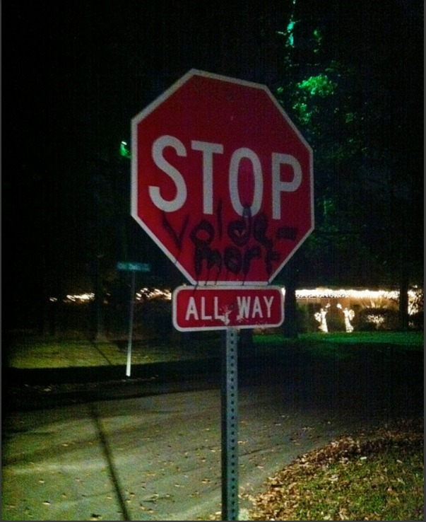
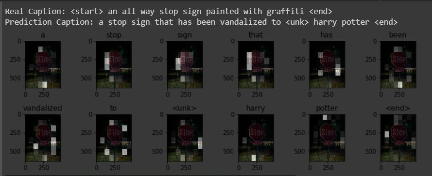
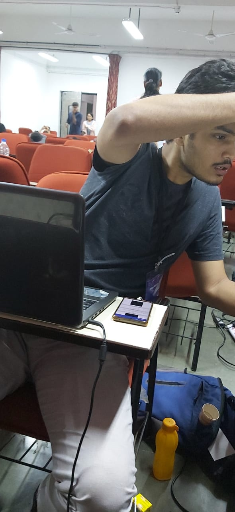
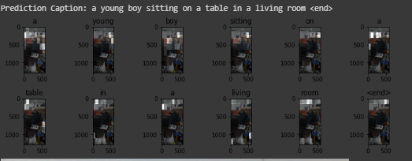

# Subtitulo: Image-captioning
A deep learning based android application which takes an image as a input and provides automatic caption for the following image.
Caption Generation is a challenging task in Artificial Intelligience where a textual description of the image must be generated.

<a href="https://www.youtube.com/watch?v=eP2SESX0ZiM">Link to the demo<a/>

# Model architecture
The model we are using is based on attention based CNN-RNN network which will allow us to focus on selective regions while generating description much like the way humans perceive the visual world.

 
<b>Dataset used</b>:The model is trained on <a href="http://cocodataset.org/#home">MS-COCO dataset </a> which is used for benchmarking object detection, segmentation and captioning datasets 
 

Flow of the process:
1. Loading of the dataset
2. Preprocessing the images
3. Preprocessing and tokenization of the captions and defining the vocabulry
4. Choosing a pre-trained model for image 
5. Splitting the data into training and testing
6. Defining the Model Architecture
7. Training the model 
8. Test the model

# Results
The results on validation dataset were:  

  

The unseen image given was:  

  
The results obtained on the model with unseen image is as shown below:
  

