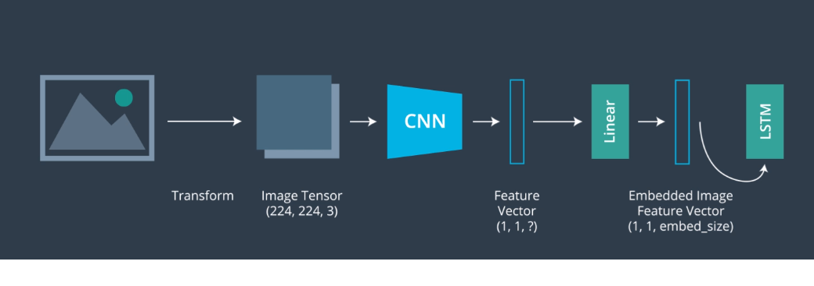

# Image-captioning
A deep learning based android application which takes an image as a input and provides automatic caption for the following image.

# Motivation
Caption Generation is a challenging task in Artificial Intelligience where a textual description of the image must be generated. 

# Model architecture
The model we are using is based on attention based framework which will allow us to focus on selective regions while generating description much like the way humans perceive the visual world.

Flow of the process:
1. Loading of the dataset
2. Preprocessing the images
3. Preprocessing and tokenization of the captions and defining the vocabulry
4. Choosing a pre-trained model for image 
5. Splitting the data into training and testing
6. Defining the Model Architecture
7. Training the model 
8. Test the model

